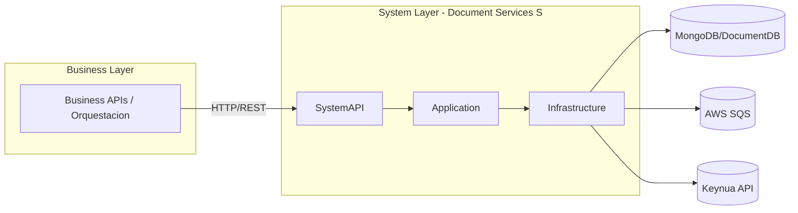
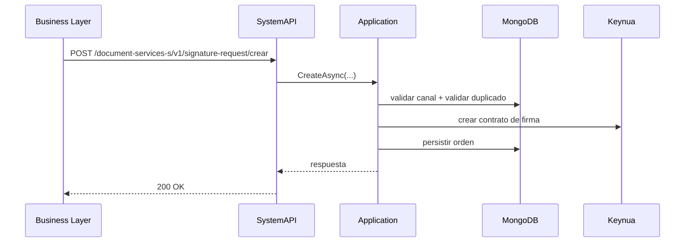
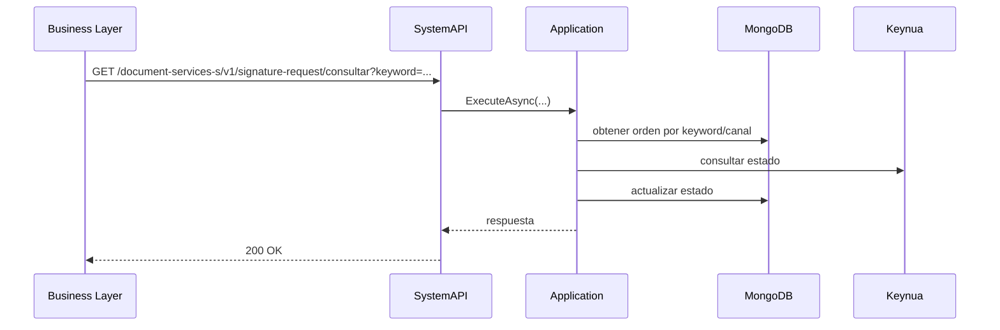
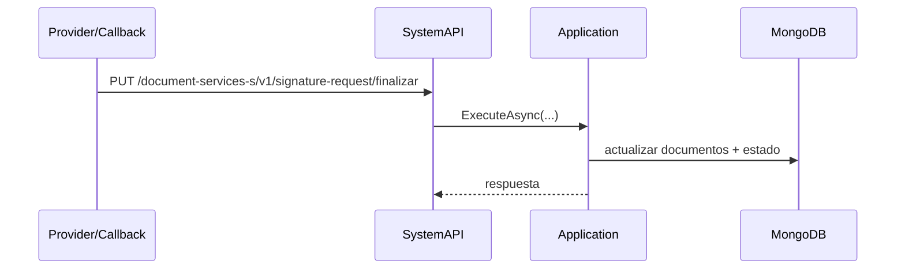
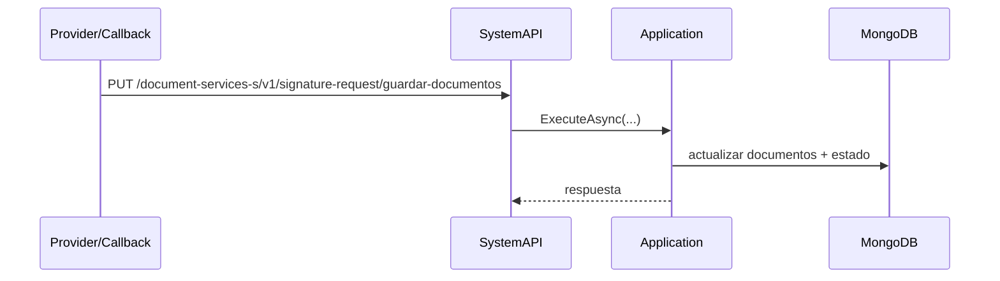
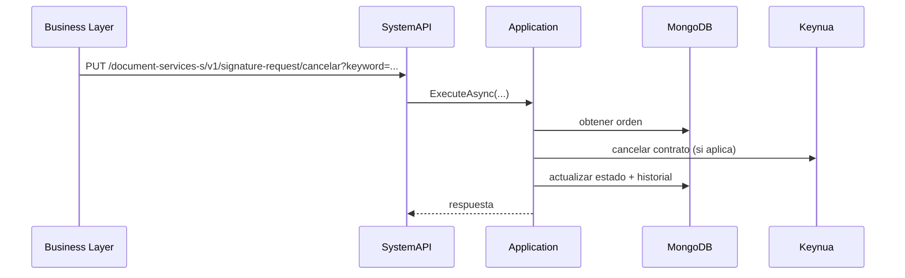
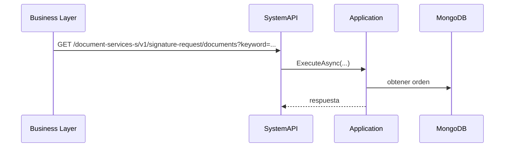

# Document Services S (System Layer)

Servicio System API para la gestion de firmas de documentos. Implementa el sistema en el nivel System Layer del modelo API-led connectivity y expone endpoints para crear, consultar, cancelar y actualizar ordenes de firma.

## Como levantar el servicio

### Local (Development)
Requiere .NET SDK 10 y acceso a las dependencias (MongoDB, Keynua, SQS).

PowerShell:
```powershell
$env:ASPNETCORE_ENVIRONMENT="Development"
dotnet run --project SystemAPI/SystemAPI.csproj
```

Linux/Mac:
```bash
ASPNETCORE_ENVIRONMENT=Development dotnet run --project SystemAPI/SystemAPI.csproj
```

En modo Development, el servicio lee configuracion desde `SystemAPI/appsettings.json`.

### Local (Production-like)
Setea las variables de entorno y ejecuta el proyecto:
```powershell
$env:ASPNETCORE_ENVIRONMENT="Production"
$env:ASPNETCORE_URLS="http://+:8080"
dotnet run --project SystemAPI/SystemAPI.csproj
```

### Contenedores
```bash
docker build -t document-services-s .
docker run --rm -p 8080:8080 --env-file .env --name document-services-s document-services-s
```

## Variables de entorno (Production)

- `ASPNETCORE_URLS`
- `ASPNETCORE_ENVIRONMENT`
- `JWT_ISSUER`
- `JWT_AUDIENCE`
- `JWT_READ_SCOPE`
- `JWT_UPDATE_SCOPE`
- `JWT_WRITE_SCOPE`
- `MONGO_DB_SERVER`
- `MONGO_DB_NAME`
- `MONGO_DB_USER`
- `MONGO_DB_PASSWORD`
- `KEYNUA_BASE_URL`
- `KEYNUA_AUTH_API_KEY`
- `KEYNUA_AUTH_AUTHORIZATION`
- `KEYNUA_BANKING`
- `KEYNUA_PRODUCT`
- `AWS_SQS_REGION`
- `AWS_SQS_QUEUE_URL`
- `AWS_SQS_MESSAGE_GROUP_ID`

Notas:
- Para AWS SQS, si no usas rol IAM, configura credenciales con variables standard de AWS (`AWS_ACCESS_KEY_ID`, `AWS_SECRET_ACCESS_KEY`, `AWS_SESSION_TOKEN`).

## Arquitectura de integracion (API Led Connectivity)



## Diagramas de flujo principales (secuencia)

### Crear orden de firma


### Consultar estado de firma


### Actualizar documentos firmados (webhooks)


### Guardar documentos firmados (webhook alterno)


### Cancelar orden de firma


### Consultar documentos firmados


## Dependencias de infraestructura

- MongoDB/DocumentDB: almacenamiento de ordenes, canales y trazas.
- AWS SQS: publicacion de eventos asincronos.
- Keynua API: proveedor de firma de documentos.
- S3 (externo): almacenamiento de documentos firmados referenciados por `S3Key`.
- IdP JWT (Cognito): emision/validacion de tokens y scopes.
- Secretos: credenciales MongoDB, Keynua, JWT, y credenciales AWS si aplica.

## Contratos y diagramas

- OpenAPI (repo): `contracts/openapi/`
- OpenAPI (Swagger UI en Development): `http://localhost:8080/swagger`
- AsyncAPI (repo): `contracts/asyncapi/`
- Lucidchart (arquitectura): `TODO`
- Lucidchart (flujos): `TODO`
